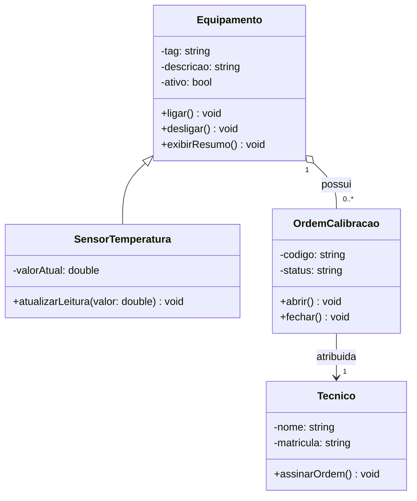

# Diagrama de Classe - Entrega do Aluno

## 1. Requisito resumido

Descrição do Problema: Controle de Calibração e Sensores

O laboratório de metrologia precisa de um sistema para gerenciar seus equipamentos e garantir a qualidade dos ensaios através dos seguintes requisitos:

* **Equipamentos:** Cadastro de dispositivos de bancada com ID, nome, modelo e status operacional (ligado/desligado).
* **Sensores de Temperatura:** Tipo específico de equipamento (herança) que realiza leituras térmicas e armazena a unidade de medida (°C/°F). Só funcionam se o equipamento estiver ligado.
* **Registro de Estado (Logs):** Histórico interno de eventos de cada equipamento contendo data, hora, descrição e criticidade. O log pertence exclusivamente ao equipamento (composição).
* **Ordens de Calibração:** Documento que agenda e acompanha as manutenções dos equipamentos, registrando o status do processo.
* **Técnico:** Profissional responsável por executar as ordens de calibração e validar as condições operacionais dos dispositivos. Uma ordem vincula um técnico a um equipamento (agregação).

## 2. Link do Mermaid Live

https://mermaid.ai/app/projects/93193229-6d8c-4493-9a96-06e7fe7a188f/diagrams/2f3b4a6e-0b23-45f1-ba68-1b052fbd76cd/version/v0.1/edit?shouldShowPopup=true&entryPoint=Dashboard

## 3. Diagrama final em Mermaid

## 4. Justificativa das relacoes

Explique, em frases curtas:

Houve generalização porque o SensorTemperatura é uma especialização de Equipamento, herdando seus atributos e estados básicos, o que evita duplicação de código. Houve composição entre Equipamento e RegistroEstado porque o histórico de logs pertence exclusivamente àquela máquina e deve ser destruído se o equipamento for excluído, enquanto houve agregação nas ordens de calibração porque os técnicos e dispositivos continuam existindo no laboratório mesmo se a ordem for deletada. A cardinalidade foi escolhida porque um equipamento acumula vários registros de log ao longo do tempo, e um técnico ou dispositivo pode estar vinculado a múltiplas ordens de manutenção (ou a nenhuma), embora cada ordem trate de apenas um executor e um aparelho por vez. Essas classes fazem sentido no domínio porque mapeiam fielmente a rotina física de um laboratório de metrologia, garantindo o rastreamento de quem calibrou cada dispositivo e protegendo regras de negócio, como impedir leituras se o sensor estiver desligado.

## 5. Linguagem escolhida

Marque a trilha usada:

- [ ] C++
- [ x ] Python

